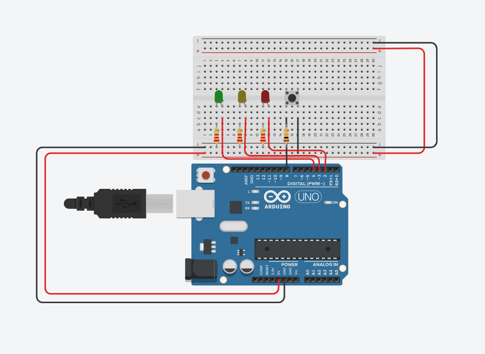
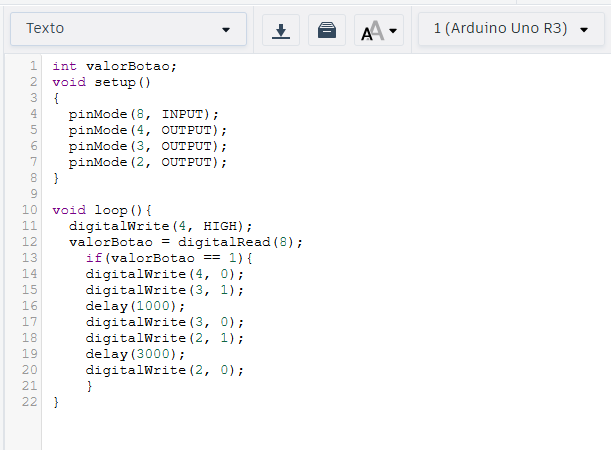

### Vinicius Valerio, Raphaela Resende e Ana Carolina.




## Componentes necessarios
``1 Arduino Uno``  
``3 LEDs (vermelho, amarelo e verde)  ``   
``3 resistores de 220Ω``   
``1 botão``     
``1 resistor de 10kΩ``   
``Fios jumper``  
``1 protoboard``  
### Explicação  
 
# 1. Começamos definindo valorBotão como um numero inteiro.  
# 2. Depois configuramos o setup  
``pinMode(8, INPUT);``  ->  Usamos para definir o botão como entrada de dados, quando pressionado.  
``pinMode(4, OUTPUT);`` -> Usamos para definir o botão como saida de dados, quando  o botão for pressionado.  
``pinMode(3, OUTPUT);`` -> Usamos para definir o botão como saida de dados, quando  o botão for pressionado.  
``pinMode(2, OUTPUT);`` -> Usamos para definir o botão como saida de dados, quando  o botão for pressionado.  
# 3. Agora configuramos o loop
  ```  
  digitalWrite(4, HIGH); -> Mantém o pino 4 em nível alto (Ligado)
  valorBotao = digitalRead(8); -> Lê o estado do botão no pino 8
    if(valorBotao == 1){  -> Condição se o botão for pressionado.
    digitalWrite(4, 0);  -> Botão quatro apaga
    digitalWrite(3, 1);  -> Botão três acende
    delay(1000);  -> Tempo de espera de 1 segundo.
  	 digitalWrite(3, 0);  -> Botão três apaga.
    digitalWrite(2, 1);  -> Botão 2 acende.
    delay(3000);  -> Tempo de espera de 3 segundos.
    digitalWrite(2, 0); -> Botão 2 apaga.   
    }
